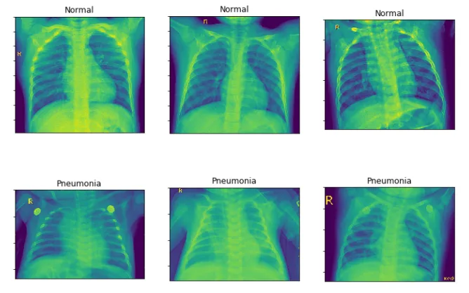
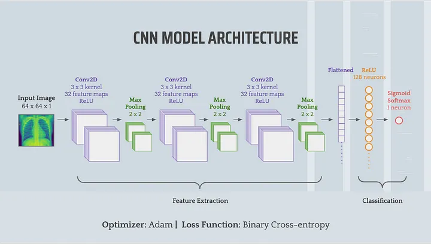

# Pneumonia-Detection-using-CNN
Analyzes images of Chest X_ray scans to detect the possibility of having Pneumonia disease, grants accuracy in prediction of disease using CNN networks and layers.

We know that pneumonia is a common illness that affects many people each year in the U.S. and around the world. How do we usually detect this disease?

## Aanalyzed Scans 🔬🔬

It turns out that chest X-rays have long been considered the best tool to detect any form of pneumonia³. However, studies have shown that even experienced radiologists often have a hard time correctly identify whether something is an infiltrate (a substance denser than air, such as pus or fluid) on the X-Ray⁴. This causes delays in diagnosis, which increases the disease severity and associated mortality rate.

## Model Architecture ⚒️⚒️

If humans aren’t able to correctly diagnose the disease early, maybe… deep learning can help!

